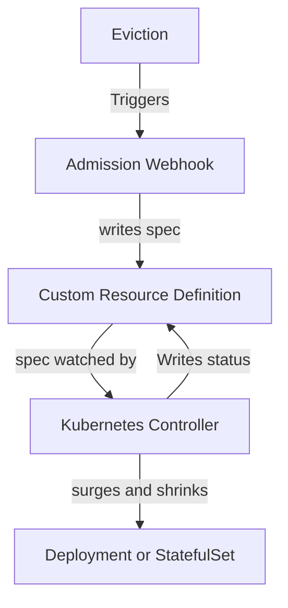

# Project Name

[](https://goreportcard.com/report/github.com/paulgmiller/k8s-pdb-autoscaler)
[](https://pkg.go.dev/github.com/paulgmiller/k8s-pdb-autoscaler)
[](LICENSE)


## Table of Contents

- [Introduction](#introduction)
- [Features](#features)
- [Installation](#installation)

## Introduction

This originated as an intern project still at github.com/Javier090/k8s-pdb-autoscaler

The general idea is that k8s deployments already have a max surge concept and there's no reason that surge is only for new deployments and not for node maitence.
It captures evictions using a webhook and writes them to a PDBWatcher CR if it exists. A controller will then try and temporarily scale up the deployment that corresponds.

### Why 
Overprovisioning isn't free. Sometimes it makes sense to run as cheap as you can. But you still don't want to be down because there was a cluster upgrade or even a vm maintence event.
Your app might also just be having a bad time for unrelated reasons and an the same maitence event shouldn't cost you down time if extra replicas can save you.

## Features

- Web hook that writes evictions to pdb watcher custom resource.
- Controller that wathces pdb watchers and if evictions are blocked because watchers PDB's disruptionsAllowed is zero then surge deployment.
- Controller Restores deployment when evictions go through with 




## Installation

### Prerequisites

- Docker
- kind for e2e tests.
- A sense of adventure

### Install

Clone the repository and install the dependencies:

```bash
git clone https://github.com/paulgmiller/k8s-pdb-autoscaler.git
cd k8s-pdb-autoscaler
hack/install.sh
hack/autodeploy.sh <some namespace you want to protect>
```

## TODO 

###  Tactical 
- Work with stateful sets.
- Make the webhook cheaper. 
- e2e
- kustomize
- cert manager. 


- Add these sections to the readme
   - [Usage](#usage)
  - [Configuration](#configuration)
  - [Examples](#examples)
  - [Contributing](#contributing)

