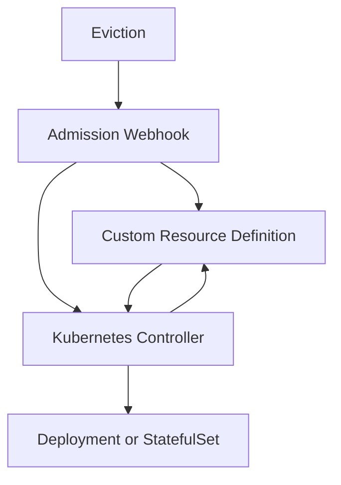

# Kubernetes Controller and Webhook for PDB Monitoring and Scaling

## Introduction

This document outlines the creation and implementation of a Kubernetes Controller and Webhook designed for Pod Disruption Budget (PDB) Monitoring and Scaling. The primary goal of this project is to optimize resource management for customers who wish to run their deployments cost-effectively without unnecessary replicas, either in single instances or fully loaded ones.

## Why Did We Create This?

We decided to develop this solution to accommodate customers seeking to run their deployments as cost-effectively as possible. These customers often face challenges in managing deployments with minimal replicas, especially when trying to balance application availability and cost savings.

By monitoring PDBs and automating scaling decisions, we can provide an efficient resource management solution that aligns with their needs.

## Problem Statement

There are often situations where users are unwilling to overprovision deployments. They are, however, willing to surge pods for deployments to avoid unnecessary disruptions. The challenge is that there is no surge during maintenance events, which can lead to either downtime or other issues.

### Example Scenario

The simplest example of this problem is a deployment with:

- **Replica Count**: 1
- **Max Surge**: 1
- **Pod Disruption Budget (PDB) with MinAvailable**: 1

In this scenario, maintenance cannot be performed on the node in question because the PDB's `MinAvailable: 1` constraint prevents any disruptions, while the deployment indicates readiness to surge. This app differs from those that specify `MaxUnavailable: 0`, which indicates it needs special handling. Its max surge already shows the intention to be disrupted, as long as a new pod is surged in first.

### Why Not Just Overprovision?

Overprovisioning isn't always a viable solution for several reasons:

- **Cost Management**: Users may be offering a free sample product where keeping Costs of Goods Sold (COGS) low is more important than ensuring 100% uptime. However, this doesn't mean they want downtime during every maintenance event. A temporary surge is still a cost-effective solution.

- **Specific Application Needs**: Consider a scenario with two replicas, where one becomes unready due to specific reasons (e.g., a random cosmic ray hit). In this case, it's better to surge new pods to replace the unready one rather than maintain overprovisioned replicas.

## Architecture Overview

Here's an overview of the architecture, including the roles of the Webhook, Custom Resource Definitions (CRD), and Controller in managing evictions and scaling:

## Webhook: Intercepting Eviction Signals

The admission webhook plays a critical role in this architecture:

- **Intercept Eviction Requests**: The webhook captures pod eviction requests and provides real-time information about these attempts.
- **Relay Information**: It communicates with the Controller and CRD, ensuring the controller can make informed scaling decisions.
- **Log Events**: The webhook logs eviction attempts, providing detailed insights into the system's state.

> **Note**: Kubernetes doesn't naturally create events during eviction attempts, as evictions aren't real objects created by the API but rather just posts on pods. This limitation necessitates the use of an admission webhook.

## Controller: Monitoring and Automating Scaling

The controller is responsible for managing and automating scaling actions:

### Monitor PDBs and Pod Evictions

- **Continuously Monitor**: Continuously monitor PDBs and detect when evictions are blocked.
- **Accurate Identification**: Ensure accurate identification of the disruption state without triggering unnecessary scaling actions.

### Automate Scaling

- **Automatic Scaling**: Automatically scale Deployments or StatefulSets when necessary, particularly when evictions are blocked due to `DisruptionsAllowed` being zero.
- **Scale Back Down**: Scale back down when `MinReplicas > 1` and the PDB is satisfied with the last attempted eviction trigger.

### Generate Events and Update Status

- **Notify Administrators**: Produce events or update the status of PDBs to notify cluster administrators about scaling actions.
- **Generate Events**: Generate events when scaling occurs and update annotations to reflect current states.

### Efficient Resource Management

- **Avoid Waste**: Avoid unnecessary scaling actions that could lead to resource wastage or application downtime.
- **Align Scaling with Needs**: Ensure scaling aligns with the actual needs of the application.

## Proposal

The solution involves updating pods with eviction attempts or failures as a status field. Currently, eviction attempts are only recorded as events, which are often noisy and less actionable.

### Implementation Details

- **Eviction Status Field**:
  - **Record Evictions**: Record eviction attempts and failures as a status field in the pod's metadata.
  - **Surge Decisions**: This change allows the deployment controller to decide when to surge new pods for each pod with failed evictions.

- **Deployment Controller Flexibility**:
  - **Leverage Information**: The deployment controller can leverage this information to surge a new pod whenever it detects a pod with a failed eviction.
  - **Sync with PDB**: This change ensures the Pod Disruption Budget (PDB) stays in sync with the deployment's desired replicas, only allowing evictions after deploying new ready pods.

- **Strategic Surge Decisions**:
  - **Decide on Surge Timing**: Determine whether to surge on the first eviction failure or wait for multiple failures to ensure an unready pod doesn't resolve itself naturally.
  - **Contextual Decisions**: The API server could provide context on whether other unready replicas exist within the PDB, allowing more informed decisions.

### Why Not Use Events Alone?

- **Noise Reduction**: While events currently capture eviction attempts, they are often noisy. Although the deployment controller could theoretically watch events, this approach would likely increase the noise further and reduce efficiency.

### Why Not Watch PDBs Directly?

- **Complexity**: Watching PDBs directly is complex due to their label-based nature, making it difficult to determine if a specific PDB applies solely to a particular deployment.

### Additional Benefits

- **Traffic Management**: This approach can also aid in preventing traffic disruption. The endpoints controller attempts to remove terminating pods, but if the current replicas are handling the maximum traffic they can manage (due to aggressive Horizontal Pod Autoscaler settings or simply running hot), surged nodes might be necessary to maintain traffic handling.
- **Dynamic Response**: This proposed solution offers a more dynamic response to real-world challenges faced during maintenance and unexpected disruptions.

## Challenges and Solutions

### Eviction Tracking

- **Challenge**: Kubernetes doesn’t naturally create events during eviction attempts, making tracking difficult.
- **Solution**: An admission webhook intercepts eviction requests, logging and tracking them to inform scaling decisions. Upstream contribution on this project could potentially eliminate the need for the webhook.

### Automating Scaling Decisions

- **Challenge**: Ensuring scaling respects the intent behind PDB and deployment configurations.
- **Solution**: The controller uses real-time data from the webhook to ensure scaling decisions align with actual needs.

### Event Generation and Status Updates

- **Challenge**: Keeping administrators informed of scaling actions.
- **Solution**: Events and status updates provide transparency about actions taken and the current resource state.

### Resource Management Efficiency

- **Challenge**: Prevent unnecessary resource allocation.
- **Solution**: Efficient scaling based on real disruptions, guided by webhook insights.

### Resource Version Management

- **Challenge**: Managing resource versions when other processes might modify resources.
- **Solution**: Implement a tracking mechanism for resource versions, ensuring scaling actions only occur when the resource version matches the expected state, preventing conflicts and ensuring consistency. The controller aborts scaling whenever external modifications are detected.

## Max Surge Consideration

When implementing the scaling logic, consider the max surge to ensure the system remains within safe resource limits. This consideration ensures that the controller scales resources appropriately without exceeding capacity or violating PDB constraints.

